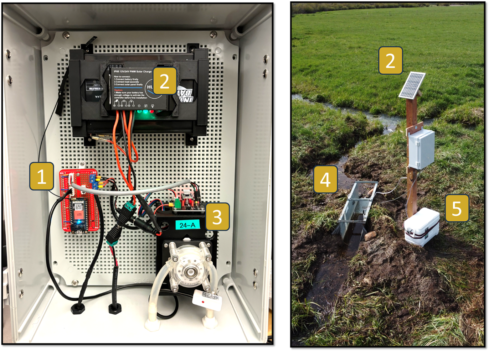
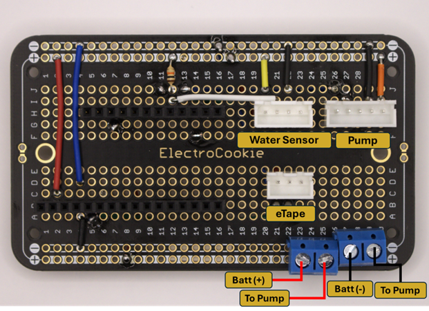
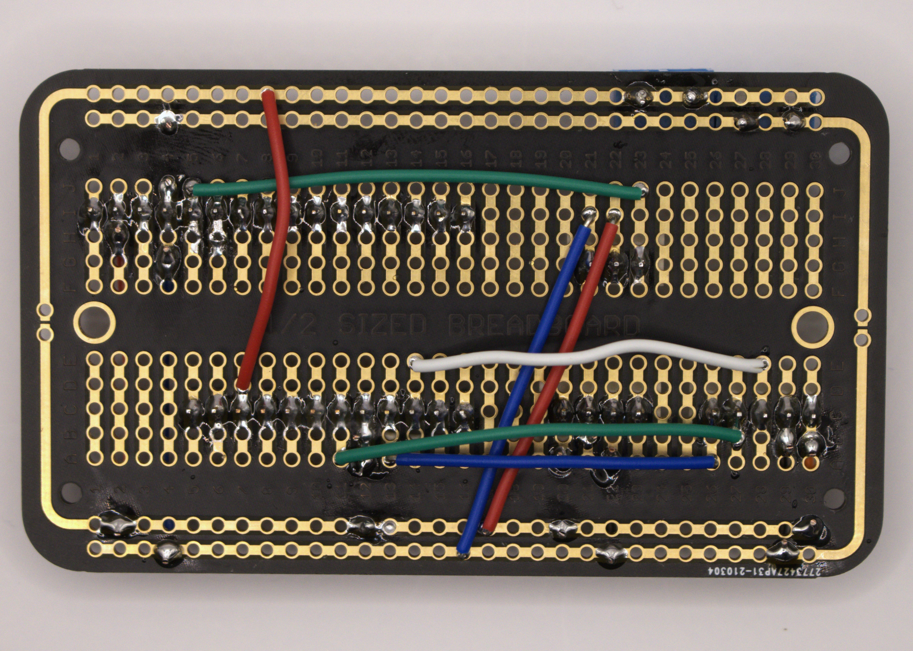

[](https://waterquality.colostate.edu)

[](https://doi.org/10.5281/zenodo.14003999)

# AWQP Low-Cost IoT Water Sampler
A low-cost, automated water sampler (LCS) with Internet of Things (IoT) technology for scalable, near-real-time water quality research developed by the Colorado State University Agricultural Water Quality Program (AWQP).

> [!NOTE]
> This project is actively under development. Code, parts, instructions, and other content are subject to change as we enhance the LCS. If you download/clone/fork this repository, we ask that you **please [email us directly](mailto:ansley.brown@colostate.edu;e.deleon@colostate.edu;erik.wardle@colostate.edu?subject=Inquiry%20about%20the%20Low%20Cost%20IoT%20Water%20Sampler%20from%20GitHub)** for the most up-to-date information and resources. We will also email you with any news related to the project moving forward!

## Table of Contents
- [Why create a low-cost water sampler?](#why-create-a-low-cost-water-sampler?)
- [Repo Contents](folder-contents)
- [Low Cost Sampler Description](#low-cost-sampler-description)
- [3D prints](#3D-prints)
- [Parts List](#parts-list)
- [How-to guide](#how-to-guide)
- [Known Bugs](#known-bugs)
- [Future Developments](#future-developments)
- [How to Cite](#how-to-cite)
- [License](#license)

---

## Why create a low-cost water sampler?
In Colorado and across the United States, agriculture is being identified as one source of nutrient
pollution in State and Federal waters. Nutrients such as nitrogen and phosphorus run off
farmlands and accumulate in surface waterways, causing water quality issues. Although
agricultural nonpoint sources are not currently regulated in Colorado, initiatives are set up to
encourage the adoption of Best Management Practices (BMPs) that protect surface water quality.
Quantifying BMP impacts on water quality, requires robust, edge-of-field (EoF) monitoring
systems that can accurately measure flow and collect water for nutrient and sediment analysis.
NRCS EoF standards currently require equipment that is often too costly for pragmatic and
scalable research. To address this need, the [Colorado State University Agricultural Water Quality
Program (AWQP)](https://waterquality.colostate.edu) has developed a low-cost, automated water sampler (LCS) with Internet of
Things (IoT) technology for scalable, near-real-time water quality research. This work directly
follows deliverables from an awarded NRCS Conservation Innovation Grant titled, “Next
Generation Technology for Monitoring Edge-of-Field Water Quality in Organic Agriculture”. The
CSU AWQP intends to create additional research and regulation opportunities for Colorado and beyond using this technology.


**Figure 1.** Image of the low-cost automated water sampler (LCS) deployed at a mountain meadow hay field near Steamboat Springs, Colorado.

To learn more about AWQP, please visit [the AWQP website](https://waterquality.colostate.edu).

## Repo Contents
- .vscode
    - settings for flashing in VS code using the particle workbench add-on.
- compiled-firmwares
    - previously compiled firmwares for various borons (current code requires a unique binary for each device to accomodate for individual e-tape calibration)
- figures
    - figures embedded into README.md
- files
    - 3D prints: contains .STL files for printing that required for assembly
    - Bill of Materials: Excel with BOM, links, and prices 
- lib
    - libraries used in source code
- src
    - source code for particle boron flashing
- target
    - available firmware targets for particle devices
- project.properties
    - contains project code and library dependencies

## Low Cost Sampler Description
The AWQP-developed LCS is comprised of six main components as shown in Figure 2: 1) a
cellular-enabled microcontroller, 2) a 12V battery, solar controller and panel, 3) a peristaltic pump with
tubing for water sample collection, 4) a water depth detecting sensor
and, 5) a cooler for sample preservation.


**Figure 2.** Picture of the low-cost automated water sampler (LCS) deployed in-situ, with its primary components annotated


Like commercial models, the LCS can detect and measure water flow in an installed flume via
depth, sample water at pre-determined or user-triggered intervals (in this case, hourly), preserve
water samples for later collection, remote data monitoring through cellular communications, and
stay powered remotely through solar and battery means. However, the LCS model accomplishes
this at approximately 1/10th of the cost of a commercial apparatus ($700-1,000). Additionally,
commercial models require the additional purchase of a cellular modem for wireless
connectivity, whereas the LCS integrally incorporates it into the microcontroller itself. Upon
completion of this experiment, the AWQP intends to open-source the LCS for future
collaborative development and sharing via GitHub repository on the AWQP GitHub
organization.


A preliminary comparison study performed by the AWQP indicate strong agreement between
LCS depth measurements and commercial bubbler units, with a root mean squared error (RMSE)
of 4.2 mm (n=1099). Additionally, measured analyte concentrations (total suspended solids,
NO3, NO2, Total N, Orthophosphate, Total Phosphorous) were similar, but lacked enough
sample points to accurately make a comparison. An example runoff depth measurement
comparison from an irrigation event at a corn field in Fort Collins, CO in 2020 is shown in
Figure 2.


**Figure 3.** Results from a preliminary flow comparison study between the LCS and commercial Teledyne ISCO 6712 automated sampler.

## Software
- Particle Account and Particle Workbench on Virtual Studio Code is needed to claim a Particle Boron and flash calibration and sampler code.  
- Blynk IoT controls and monitors the LCS remotely via phone app. 
- (optional) Ubidots offers storage and visualization of sampler data. 

## 3D-prints
Can be found on our [AWQP Printables page](https://printables.com/@AgWaterQuality_66019):
* [Peristaltic pump mount](https://printables.com/model/560168-mount-for-a-peristaltic-pump)
* [12v Battery  mount](https://printables.com/model/560141-awqp-12v-battery-mount-for-the-low-cost-sampler)
* [Solar Controller Mount](https://www.printables.com/model/1177165-solar-controller-huine-mount-for-low-cost-iot-wate)
* [eTape TPU Cover](https://www.printables.com/model/1177200-milone-etape-tpu-protective-cover-for-awpq-low-cos) 

## Parts List
Please [contact the AWQP](mailto:ansley.brown@colostate.edu;e.deleon@colostate.edu;erik.wardle@colostate.edu?subject=Inquiry%20about%20the%20Low%20Cost%20IoT%20Water%20Sampler%20from%20GitHub) for the most current part list; these are often changing and being updated as improvements get implemented!

Current list updated 03 Feb. 2025:

| Designator                                | Component                                                                                                                                                                    | Number | Cost per unit (USD) | Total cost (USD) | Source of materials                                                                                                                                                                                                                                                                                                                                                                                                                                                                                                      | Material type         |
|-------------------------------------------|------------------------------------------------------------------------------------------------------------------------------------------------------------------------------|--------|---------------------|------------------|--------------------------------------------------------------------------------------------------------------------------------------------------------------------------------------------------------------------------------------------------------------------------------------------------------------------------------------------------------------------------------------------------------------------------------------------------------------------------------------------------------------------------|-----------------------|
| Waterproof Enclosure                      | Ogrmar ABS Plastic Dustproof Waterproof IP65 Junction Box Universal Enclosure with Lock (15.7"x11.8"x7")                                                                    | 1      | $70.98              | $70.98           | [Amazon](https://a.co/d/9mMv2tu)                                                                                                                                                                                                                                                                                                                                                                                                                                                                                           | Electronic Enclosure  |
| Peristaltic Pump                          | INTLLAB High Flow Peristaltic Self-Priming Pump with Stepper Motor 12V/24V High Flow Peristaltic Pump, DP-520-48S                                                                | 1      | $45.80              | $45.80           | [Amazon](https://www.amazon.com/gp/product/B082K6CYV1/ref=ppx_yo_dt_b_search_asin_title?ie=UTF8&th=1)                                                                                                                                                                                                                                                                                                                                                                                                                      | Non-specific          |
| Battery                                   | ExpertPower 12V 7 Amp EXP1270 Rechargeable Lead Acid Battery                                                                                                                 | 1      | $23.00              | $23.00           | [Amazon](https://www.amazon.com/ExpertPower-EXP1270-Rechargeable-Lead-Battery/dp/B003S1RQ2S/ref=sr_1_4?keywords=12v%2Bbattery&qid=1578353558&sr=8-4&th=1)                                                                                                                                                                                                                                                                                                                                                        | Non-specific          |
| Solar Panel                               | ECO-WORTHY 12V Solar Panel 10W Solar Panel                                                                                                                                     | 1      | $25.00              | $25.00           | [Amazon](https://www.amazon.com/dp/B00OZC3X1C?_encoding=UTF8&psc=1&ref=cm_sw_r_cp_ud_dp_78WSV78VQNK2S49E7WR0_2&ref_=cm_sw_r_cp_ud_dp_78WSV78VQNK2S49E7WR0_2&social_share=cm_sw_r_cp_ud_dp_78WSV78VQNK2S49E7WR0_2&skipTwisterOG=1)                                                                                                                                                                                                                                                                  | Non-specific          |
| Solar Charge Controller                   | Huine 10A PWM Solar Charge Controller Waterproof IP68 12V 24V Solar Panel Controller Regulator                                                                             | 1      | $19.99              | $19.99           | [Amazon](https://www.amazon.com/HUINE-Waterproof-Controller-Intelligent-Regulator/dp/B07Q79TC2L/ref=sr_1_1?crid=3D7Z8WJIERXRY&dib=eyJ2IjoiMSJ9.7oBpDYFJc2s8rktVXPvRjzDCqJvLTlZpqf6Tl8pmMGkvAlp8XuVItp_8CwyDNzFggqsmOQzg6reKxmGjlseXxYoSgClGSVj8ctvlBCblZGbq56bX-NLVE7NkL2ZSm6ip0DR8xNu-zW_3mmoGTzc-Rp_5yUgX4PRCnGJ0t6ufBYmau0IoIFBL6RiwUCWw-xbANkO5naZFfYSTIshIOrlcvP-iIVJz3qJv4NenreaUVFY.MvVnljx3RBEnaR3Ce2Zuowq593ullNOUnMbTYq9k--g&dib_tag=se&keywords=huine+solar+charge+controller&qid=1726158050&sprefix=huine+solar+charge+controller%2Caps%2C97&sr=8-1)                                                                                                                                                                                                                                          | Non-specific          |
| Microprocessor                            | Particle Boron LTE North America                                                                                                                                               | 1      | $48.95              | $48.95           | [Particle](https://store.particle.io/collections/cellular/products/boron-lte-cat-m1-noram-with-ethersim-4th-gen)                                                                                                                                                                                                                                                                                                                                                                                                 | Non-specific          |
| PCB Board                                 | ElectroCookie Prototype PCB Solderable Breadboard for Electronics Projects                                                                                                    | 1      | $7.99               | $7.99            | [Amazon](https://www.amazon.com/gp/product/B07ZV8BKNF/ref=ppx_yo_dt_b_search_asin_title?ie=UTF8&psc=1)                                                                                                                                                                                                                                                                                                                                                                                                                 | Non-specific          |
| Standoffs                                 | Motherboard Standoffs Plastic Mounting PCB                                                                                                                                   | 1      | $10.99              | $10.99           | [Amazon](https://a.co/d/34yRwN2)                                                                                                                                                                                                                                                                                                                                                                                                                                                                                           | Non-specific          |
| Pump Driver                               | HiLetgo 5pcs DRV8825 Stepper Motor Driver Module                                                                                                                             | 1      | $14.49              | $14.49           | [Amazon](https://a.co/d/hqn6itl)                                                                                                                                                                                                                                                                                                                                                                                                                                                                                           | Non-specific          |
| Pump Driver Mount                         | Stepper Motor Driver Shield Expansion Board DRV8825/A4988                                                                                                                   | 1      | $8.00               | $8.00            | [Amazon](https://www.amazon.com/gp/product/B08RP2SCJ7/ref=ppx_yo_dt_b_search_asin_title?ie=UTF8&psc=1)                                                                                                                                                                                                                                                                                                                                                                                                                 | Non-specific          |
| Feather Board Pins                        | 2.54mm Spacing Female 16 Pins PCB                                                                                                                                             | 1      | $8.00               | $8.00            | [Amazon](https://www.amazon.com/gp/product/B07HCCTY94/ref=ppx_yo_dt_b_search_asin_title?ie=UTF8&psc=1)                                                                                                                                                                                                                                                                                                                                                                                                                 | Non-specific          |
| Feather Board Pins                        | 2.54mm Pitch 12 Terminals Straight Header                                                                                                                                     | 1      | $6.00               | $6.00            | [Amazon](https://www.amazon.com/gp/product/B07PVY4D52/ref=ppx_yo_dt_b_search_asin_title?ie=UTF8&psc=1)                                                                                                                                                                                                                                                                                                                                                                                                                 | Non-specific          |
| Terminal pin                              | 2 Pin 3 Pin PCB Mount Screw Terminal Block Connectors,Socket Strips 5.08mm                                                                                                 | 1      | $8.69               | $8.69            | [Amazon](https://a.co/d/hsZmwHm)                                                                                                                                                                                                                                                                                                                                                                                                                                                                                           | Non-specific          |
| Jumper wires                              | 24AWG 840 Pieces Jumper Wires Kit                                                                                                                                              | 1      | $15.50              | $15.50           | [Amazon](https://a.co/d/1k19Dlo)                                                                                                                                                                                                                                                                                                                                                                                                                                                                                           | Non-specific          |
| Water Level                               | 18" Standard eTape® Assembly with custom sturdy wiring                                                                                                                        | 1      | $65.00              | $65.00           | [MiloneTech](https://milonetech.com/products/standard-etape-assembly)                                                                                                                                                                                                                                                                                                                                                                                                                                                          | Non-specific          |
| Liquid Sensor                             | Non-Contact Water Level Sensor Capacitive Liquid Level Detector                                                                                                              | 1      | $17.68              | $17.68           | [Amazon](https://www.amazon.com/gp/product/B0832YDTPX/ref=ppx_yo_dt_b_search_asin_title?ie=UTF8&psc=1)                                                                                                                                                                                                                                                                                                                                                                                                                 | Non-specific          |
| Glands                                    | Cable Gland 20 Pack PG7 Waterproof                                                                                                                                             | 1      | $8.99               | $8.99            | [Amazon](https://www.amazon.com/gp/product/B09X4GK3FT/ref=ppx_yo_dt_b_search_asin_title?ie=UTF8&psc=1)                                                                                                                                                                                                                                                                                                                                                                                                                 | Polymer               |
| Power Plugs (Solar)                       | 12V Male+Female 2.1x5.5MM DC Power Jack Plug                                                                                                                                   | 1      | $6.79               | $6.79            | [Amazon](https://www.amazon.com/gp/product/B01J1WZENK/ref=ppx_yo_dt_b_search_asin_title?ie=UTF8&psc=1)                                                                                                                                                                                                                                                                                                                                                                                                                 | Non-specific          |
| Power Plugs (Load)                        | DC Power Pigtail Cable,5.5x2.1mm 18AWG Male and Female DC Connector Plug,12V 5A Barrel Jack (5 Pairs)                                                                          | 1      | $6.66               | $6.66            | [Amazon](https://www.amazon.com/Pigtail-5-5x2-1mm-Connector-Security-Lighting/dp/B0DB4N14F3/ref=sr_1_1?crid=1VWFWCTL716ZI&dib=eyJ2IjoiMSJ9.NYpJamgi_uREOdYhvviRDE8JzaNZEzOSZN9tM5eHMoBz1H-YgEIOcOoUCEHKF4Rh5dGoJTy_JmPeUeqYIGEy-czMH01uheBFjDfXGDmV4leXOj3eIrFQzdy4ShCA0NVull9eCs3Pz29MF043FSLgO0xykt6hudzem6POgPNbStM.jrNHqL3v9Whz_tWhFbumRtwMerv0upBRBCgTarwgNQM&dib_tag=se&keywords=vonvoff%2Bdc%2Bpower&qid=1726159744&s=hi&sprefix=vonvoff%2Bdc%2Bpower%2Ctools%2C106&sr=1-1-catcorr&th=1)                                                                                                                                                                                                           | Non-specific          |
| Pump to PCB and Water Level to PCB Wire Connectors | Taiss Dupont Crimping Tool Kit Ratcheting Wire Crimper with 2.54mm 600PCS Dupont Connectors and 560PCS JST XH Connectors, Dupont Crimper, JST Crimper(0.08-0.5mm² 28-20AWG) | 1      | $26.99              | $26.99           | [Amazon](https://www.amazon.com/Taiss-Crimping-Ratcheting-Connectors-0-08-0-5mm%C2%B2/dp/B0C6PM9KGY/ref=sr_1_1?crid=5YMY7DKIIF0Z&dib=eyJ2IjoiMSJ9.1vTpc09479e4j6_4KN6u6QishYv8AY27H0_3oYASSNWIFBELydkoaEtLmRYxoPm_JoBhn6Xizj-VPv2uAAky2laJPKplvTNCpIAjuttSllIal7J67pcIaVhk0Bb4bQaJnukTgjbWR_EnlnHi1wLU7jvshSNXQPZt-fy3BUqbM40Utgo5ErX-iobDvku8KJkzCeEElPJp1xRwALpaPnCIUizunttbzfR8DpVak8Xs3v1nC72w1LtqhylpTxQDTDwonw_CaHue5wNloALjzwestKUNo_i0EImE91vHqtbQWHE.doRQNvffbvOi5sT_j-CYjs3sSLr-ftZHaOWbM2pLKMQ&dib_tag=se&keywords=720pcs+2.54mm+JST-XHP&qid=1726159927&s=hi&sprefix=720pcs+2.54mm+jst-xhp%2Ctools%2C104&sr=1-1) | Non-specific          |
| Waterproof Connector for Water level     | 3 Pin Electrical Connector 22AWG Waterproof IP65 Male Female Connector                                                                                                    | 1      | $9.99               | $9.99            | [Amazon](https://a.co/d/ewJF8lv)                                                                                                                                                                                                                                                                                                                                                                                                                                                                                           | Non-specific          |
| Heat Shrink                               | 1/4" Heat Shrink Tubing - 3:1 Ratio Dual Wall Adhesive Lined                                                                                                                | 1      | $9.99               | $9.99            | [Amazon](https://a.co/d/8yxQi5g)                                                                                                                                                                                                                                                                                                                                                                                                                                                                                           | Non-specific          |
| Bottle Enclosure                          | Igloo BMX Hard Coolers (25qt)                                                                                                                                                  | 1      | $99.00              | $99.00           | [Amazon](https://www.amazon.com/gp/product/B0B4X57WZY/ref=ppx_yo_dt_b_search_asin_title?ie=UTF8&psc=1)                                                                                                                                                                                                                                                                                                                                                                                                                 | Polymer               |
| Tubing Adapter                            | 10 Packs 1/4 Thru-Bulk Bulkhead Plastic Hose Barb Fittings Plastic Hose Barb Fittings 1/4"                                                                                   | 2      | $8.89               | $8.89            | [Amazon](https://www.amazon.com/dp/B0CBRNBYSD?ref=fed_asin_title)                                                                                                                                                                                                                                                                                                                                                                                                                                                         | Polymer               |
| Tubing                                    | PVC Tubing 1/4"ID X 3/8"OD Flexible Clear Vinyl Hose 100 Feet...                                                                                                             | 1      | $27.99              | $27.99           | [Amazon](https://www.amazon.com/gp/product/B07WCM9B9H/ref=ppx_yo_dt_b_search_asin_title?ie=UTF8&th=1)                                                                                                                                                                                                                                                                                                                                                                                                                 | Polymer               |
| 2L Bottle                                 | Bottles                                                                                                                                                                       | 2      | $30.00              | $60.00           | [US Plastic](https://www.usplastic.com/catalog/item.aspx?itemid=34227&v1=&v7=&gad_source=1&gclid=Cj0KCQiAgqGrBhDtARIsAM5s0_lNtdxKP6RPs_ngv4Kppt8AFrtlITrcvWsjd5ZQKeNmv4hUJ4Kuh4waAuoAEALw_wcB)                                                                                                                                                                                                                                                                                                                                        | Polymer               |
| Screws                                    | M3 x 12mm 304 Stainless Steel                                                                                                                                                  | 1      | $7.69               | $7.69            | [Amazon](https://a.co/d/5672PfI)                                                                                                                                                                                                                                                                                                                                                                                                                                                                                           | Metal                  |
| Solder&Seal Connectors                    | haisstronica 500PCS White Heat Shrink Butt Connectors 26-24 Gauge-Insulated Waterproof Electrical Butt Connectors                                                           | 1      | $29.39              | $29.39           | [Amazon](https://a.co/d/eA2VKj1)                                                                                                                                                                                                                                                                                                                                                                                                                                                                                           | Polymer               |
| **Estimated Total**                       |                                                                                                                                                                              |        |                     | **$698.43**      |                                                                                                                                                                                                                                                                                                                                                                                                                                                                                                                          |                       |


## How-to guide
Introduction to major hardware components with a brief description:

- Enclosure: Protects the sampler components from the environment
- Pump Assembly: a peristaltic pump to collect water samples 
    - DRV8825 Motor Driver: Controls peristaltic pump with precision and efficiency
    - Non-contact water sensor: Detects water priming the pump
- Power Assembly: 12-volt Battery 
    - Solar Panel (10W): Charges Battery 
    - Solar Charging/Controller: Regulates power from the solar panel to the battery 
- Device Control Unit: PCB Carrier for the Particle Boron Microprocessor and all sensor connection points
- Water Depth Sensor: Using a eTape Water Level Sensor to monitor water level in flumes or streams. 
    - **Note:** For outdoors used  the sturdy eTape cable directly from the manufacturer, Milone Technologies.
- Water Storage Apparatus: Holds sample bottles and keeps collected samples cool. 


Steps 

1. Purchase all necessary hardware components 
2. 3D-print necessary mounting parts
3. Assemble hardware - [Here's our video guide!](https://youtu.be/WXuII_zaUJU?si=he2FRvl1eTsFYpLh)

[](https://youtu.be/WXuII_zaUJU?si=he2FRvl1eTsFYpLh)


<br>  **Device Control Unit:** 


    

**Figure 4.** Device Control Unit:  PCB front and back with wiring connection layouts and labels 

<br>

**Particle** **Boron** **Pinout**
| Left Pinout (16) | Function     | Right Pinout (12) | Function        |
|:------------------:|:--------------:|-------------------:|:-----------------:|
| RST              |              | Li+               |                 |
| 3.3              |              | EN                |                 |
| MD               |              | USB               |                 |
| Ground           |              | D8                |                 |
| A0               | Etape        | D7                |                 |
| A1               |              | D6                |                 |
| A2               |              | D5                | Step            |
| A3               |              | D4                | Water sensor    |
| A4               |              | D3                | DIR             |
| A5               |              | D2                | StepEN          |
| D13              |              | D1                | SCL i2C         |
| D12              |              | D0                | SDA i2C         |
| D11              |              |                   |                 |
| D10              |              |                   |                 |
| D9               |              |                   |                 |
| NC               |              |                   |                 |

<br>


4. Install Blynk phone application - [Bynk application website](https://blynk.io/)

The LCS requires user inputs to program the sampling protocol. These inputs include Volume to Sample (mL), Sampling Interval (min), Threshold (cm), Sample Bottle (mL). Using Blynk, users will input how much volume to collect (max 700mL per sample interval), how often to sample in minutes, the threshold depth in centimeters that will activate your sampler to start collecting water, and how large is the sample bottle to prevent sample slipovers.

- Setup Template 
- Add the following Datastreams as virtual pins 

<br>

| Name              | Virtual Pin | Data Type | Unit   | Min-Max    | Default |
|:-----------------:|:-------------:|:-----------:|:--------:|:------------:|:---------:|
| mL to Sample      | V1          | Integer   | (mL)   | 0 - 700   | 200     |
| Terminal Status   | V2          | String    |        |            |         |
| Sample Interval   | V3          | Integer   | (min)  | 0 - 720    | 60      |
| Threshold         | V4          | Integer   | (cm)   | 0 - 100    | 100     |
| Sample Bottle     | V5          | Integer   | (mL)   | 0 - 10000  | 2000    |
| Sample Now        | V9          | Integer   |        |            |         |
| mL to Collect     | V12         | Integer   | (mL)   | 0 - 1000   | na      |
| Current Threshold | V14         | Integer   | (cm)   | 0 - 100    | na      |
| Current Depth     | V17         | Integer   | (cm)   | 0 - 100    | na      |

<br>

5. Make Ubidots account - [Ubidots website](https://industrial.ubidots.com/)
6. eTape and Pump Calibration

    - eTape Calibration [Repo](https://github.com/CSU-Agricultural-Water-Quality-Program/AWQP-LCS-Etape-Calibration/tree/main) 
    - Pump Calibrtion [Repo](https://github.com/CSU-Agricultural-Water-Quality-Program/AWQP_LCS_pump_calibration)

7. Flash code from this repo, after updating the `config.h` file with your TOKENs from Blynk and Ubidots
8. Use the Blynk app to program you sampler 
9. Depoly and Enjoy!

### Configuration file instructions

For the code to run properly, you'll need to set up a `config.h` file with your API keys and other configurations.

1. **Navigate to the `src` directory**:
   - Inside the `src` directory, you will find a template file named `config_template.h`.

2. **Duplicate and Rename**:
   - Copy the `config_template.h` and rename the copied file to `config.h`.

3. **Add Your API tokens for Ubidots and Bylnk**:
   - Open `config.h` with a text editor of your choice. Replace the placeholders like `"YOUR_API_KEY_HERE"` with your actual API keys or other configuration details.

4. **Save and Close**:
   - After adding your details, save and close the file. Now your code should be able to run with your specific configurations.

> [!WARNING]
> Never commit your `config.h` with your actual API keys or Tokens to public repositories to ensure the privacy of your keys!

## Known bugs
- The water detection sensor is unreliable in its current state; we are not sure if this is a hardware or software issue at the moment. Currenlty working on fix. 
- In outdoor deployment, the normal wired Etape readings can bounce, leading to unintentional sampling. This bounce has not been observed in the strudier wired Etape specially requested with the TPU cover. Highly recommended to request the sturdy eTape cable directly from the manufacturer, Milone Technologies.
    - we tend to leave the trigger point at an unrealistically high number until the device *should* be sampling, then we move it down to a realistic number (e.g., 2cm)
- Etape sensors only begin to accurately read depth at the 1" mark on the device
    - this is a hardware design from Mileone
    - to circumvent this, we place the etape at -1" depths in the deployed stilling wells or other water bodies to ensure an accurate reading, then subtract 1" off of readings in post-processing for flow calculations.

## Latest updates
- v1.00 - Initial Release - Rough program outline with serial monitor// interface
- v1.01 - First Working Version, debugged with keyboard input of sample volume
- v1.02 - Uses Blynk  and WiFi for input and reporting instead of keyboard IDE
- v1.03 - Add stats and other Blynk features, provisions for prepurge of hose
- v1.04 - add a secound pump to the code
- v1.05 - coverted to particle using workbench
- v1.06 - added etape
- V1.07 - moved to new blynk IoT
- V1.08 - cleaned, added variable, add temp resistance to etapeand add project to private github repo
- V1.09 - added remote reset function
- V1.10 - added config.h file to store sensitive info and device speicific info
- V1.2 - fixed config.h file and updates bill of materials
- V1.21 - Added images, pinout, and blynk datastreams to the How To section

## Future Developments
- Integrate a "time until next sampling" variable that can be called or sent at each payload
- make e-tape calibration coeficcients either a dictionary and/or a particle variable to alleviate the need for tailored binaries to flash each device.  Ultimately, this would allow users to make the device a particle product and enable fleet flashing.
- if the water detection sensor continues to fail we will add a "tube length" variable in the blynk app to calculate water needed to prime the pump prior to sampling.
- compare etape calibration data to see if a universal calibration equation can be developed instead of having individual calibration equations for each device
- include firmware to add in situ water quality sensor like pH and turbidity 

## How to Cite

If you use the AWQP Low-Cost IoT Water Sampler (LCS) in your research or if it proves helpful in your work, please consider citing it. a [CITATION.cff](CITATION.cff) file is provided, or you can use the following BibTeX entry:

```bibtex
@misc{awqp_lcs_2024_v2,
  author       = {Emmanuel Deleon and Ansley Brown and Erik Wardle and Troy Bauder and Dylan Casey and Jay Ham and Mark Uchanski},
  title        = {{Low-Cost IoT Water Sampler}},
  month        = oct,
  year         = 2024,
  note         = {Version 1.2},
  doi          = {10.5281/zenodo.14003999},
  publisher    = {Zenodo},
  url          = {https://zenodo.org/doi/10.5281/zenodo.14003999}
}
```

## License
This project is licensed under the GNU GENERAL PUBLIC LICENSE Version 2 (GNU GPL V2.0) - see the [LICENSE.md](LICENSE.md) file for details.

**Please visit [CSU STRATA's website](https://csustrata.org/technology-transfer/available-technology/low-cost-automated-water-sampler/) to inquire about a permissive commercial license for this project, and use the [contact form on that page](https://csustrata.org/technology-contact-2024-035/) for initiating that discussion.**

Copyright © 2023 Colorado State University Agricultural Water Quality Program. All rights reserved.