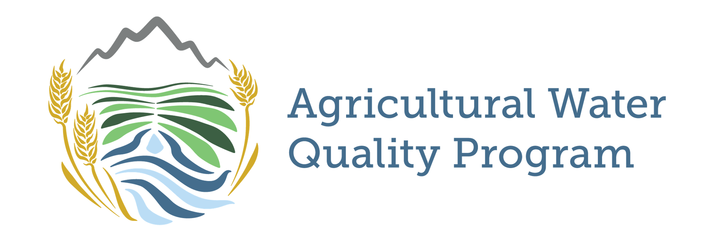

# AWQP Low-Cost Water Sampler (LCS)
A low-cost, automated water sampler (LCS) with Internet of Things (IoT) technology for scalable, near-real-time water quality research developed by the Colorado State University Agricultural Water Quality Program (AWQP).

## Table of Contents
- [Why create a low-cost water sampler?](#why-create-a-low-cost-water-sampler?)
- [Repo Contents](folder-contents)
- [Low Cost Sampler Description](#low-cost-sampler-description)
- [3d prints](#3d-prints)
- [Parts List](#parts-list)
- [How-to guide](#how-to-guide)
- [Known Bugs](#known-bugs)
- [Future Developments](#future-developments)

---

## Why create a low-cost water sampler?
In Colorado and across the United States, agriculture is being identified as one source of nutrient
pollution in State and Federal waters. Nutrients such as nitrogen and phosphorus run off
farmlands and accumulate in surface waterways, causing water quality issues. Although
agricultural nonpoint sources are not currently regulated in Colorado, initiatives are set up to
encourage the adoption of Best Management Practices (BMPs) that protect surface water quality.
Quantifying BMP impacts on water quality, requires robust, edge-of-field (EoF) monitoring
systems that can accurately measure flow and collect water for nutrient and sediment analysis.
NRCS EoF standards currently require equipment that is often too costly for pragmatic and
scalable research. To address this need, the [Colorado State University Agricultural Water Quality
Program (AWQP)](https://waterquality.colostate.edu) has developed a low-cost, automated water sampler (LCS) with Internet of
Things (IoT) technology for scalable, near-real-time water quality research. This work directly
follows deliverables from an awarded NRCS Conservation Innovation Grant titled, “Next
Generation Technology for Monitoring Edge-of-Field Water Quality in Organic Agriculture”. The
CSU AWQP intends to create additional research and regulation opportunities for Colorado and beyond using this technology.

**Figure 1.** Image of the low-cost automated water sampler (LCS) deployed at a mountain meadow hay field near Steamboat, Colorado.

To learn more about AWQP, please visit [the AWQP website](https://waterquality.colostate.edu).

## Repo Contents
- .vscode
    - settings for flashing in VS code using the particle workbench add-on.
- 3d-prints
    - contains .STL files for printing required assembly parts on a 3d-printer
- compiled-firmwares
    - previously compiled firmwares for various borons (current code requires a unique binary for each device to accomodate for individual e-tape calibration)
- figures
    - figures embedded into README.md
- lib
    - libraries used in source code
- src
    - source code for particle boron flashing
- target
    - available firmware targets for particle devices
- project.properties
    - contains project code and library dependencies

## Low Cost Sampler Description
The AWQP-developed LCS is comprised of six main components as shown in Figure 2: 1) a
cellular-enabled microcontroller, 2) a 12V battery and solar charger, 3) a peristaltic pump with
tubing for water sample collection, 4) a 12V, 10W solar panel, 5) a water depth detecting sensor
and, 6) a cooler for sample preservation.

**Figure 2.** Picture of the low-cost automated water sampler (LCS) deployed in-situ, with its primary components annotated: 1) a cellular-enabled microcontroller, 2) a 12 V battery and solar charger, 3) a peristaltic pump with tubing, 4) a X V, X W solar panel, 5) a water depth detecting sensor, and 6) a cooler.

Like commercial models, the LCS can detect and measure water flow in an installed flume via
depth, sample water at pre-determined or user-triggered intervals (in this case, hourly), preserve
water samples for later collection, remote data monitoring through cellular communications, and
stay powered remotely through solar and battery means. However, the LCS model accomplishes
this at approximately 1/10th of the cost of a commercial apparatus ($700-1,000). Additionally,
commercial models require the additional purchase of a cellular modem for wireless
connectivity, whereas the LCS integrally incorporates it into the microcontroller itself. Upon
completion of this experiment, the AWQP intends to open-source the LCS for future
collaborative development and sharing via GitHub repository on the AWQP GitHub
organization.

A preliminary comparison study performed by the AWQP indicate strong agreement between
LCS depth measurements and commercial bubbler units, with a root mean squared error (RMSE)
of 4.2 mm (n=1099). Additionally, measured analyte concentrations (total suspended solids,
NO3, NO2, Total N, Orthophosphate, Total Phosphorous) were similar, but lacked enough
sample points to accurately make a comparison. An example runoff depth measurement
comparison from an irrigation event at a corn field in Fort Collins, CO in 2020 is shown in
Figure 2.

**Figure 3.** Results from a preliminary flow comparison study between the LCS and commercial Teledyne ISCO 6712 automated sampler.

## 3d-prints
As found on our [AWQP Printables page](https://www.printables.com/@AgWaterQuality_66019):
* [Peristaltic pump mount](https://www.printables.com/model/560168-mount-for-a-peristaltic-pump)
* [12v alkaline battery and solar charger mount](https://www.printables.com/model/560141-awqp-12v-battery-mount-for-the-low-cost-sampler)

## Parts List
Please contact the AWQP for the most current part list; these are often changing and being updated as improvements get implemented!

| Part Name                                                                                                         | Part Type               | Cost per Unit | Est # Per Sampler | Total Cost per Box | Link One                                                                                                                                                                                                                                                                        |
|------------------------------------------------------------------------------------------------------------------|-------------------------|---------------:|------------------:|-------------------:|--------------------------------------------------------------------------------------------------------------------------------------------------------------------------------------------------------------------------------------------------------------------------------|
| 6-30V Large Flow Dosing Pump Peristaltic Pump for Vacuum Aquarium Lab Analytical with Step Motor(304 Stainless Steel Roller) | Peristaltic Pump       | $44.69        | 2                | $89.38             | [Link](https://www.amazon.com/gp/product/B07V9NLHHP/ref=ppx_yo_dt_b_asin_title_o02_s00?ie=UTF8&psc=1)                                                                                                               |
| ExpertPower 12V 7 Amp EXP1270 Rechargeable Lead Acid Battery                                                      | Battery                | $18.00        | 1                | $18.00             | [Link](https://www.amazon.com/ExpertPower-EXP1270-Rechargeable-Lead-Battery/dp/B003S1RQ2S/ref=sr_1_4?keywords=12v+battery&qid=1578353558&sr=8-4)                                                                    |
| Morningstar SS-6-12V Sunsaver-6 Amp                                                                               | solar power controller | $47.45        | 1                | $47.45             | [Link](https://www.amazon.com/Morning-Star-SS-6-12V-Morningstar-Sunsaver-6/dp/B00P9JAYUI/ref=sr_1_6?keywords=sunsaver&qid=1578353734&sr=8-6)                                                                        |
| Particle Boron LTE North America                                                                                  | microprocessor         | $53.00        | 1                | $53.00             | [Link](https://store.particle.io/collections/cellular/products/boron-lte)                                                                                                                                            |
| PCB board for Edge of Field Sampling                                                                    | PCB Board              | $20.00        | 1                | $20.00             | NA                                                                                                                                                                                                                     |
| DRV8825 Stepper Motor Driver Carrier, High Current                                                               | Pump Driver            | $8.95         | 2                | $17.90             | [Link](https://www.pololu.com/product/2133)                                                                                                                                                                           |
| 3D Printer 42CH Stepper Motor Driver Shield Expansion Board DRV8825/A4988                                        | Pump driver mount      | $5.00         | 2                | $10.00             | [Link](https://www.amazon.com/Printer-Stepper-Driver-Expansion-DRV8825/dp/B07QPD98CY/ref=sr_1_2?dchild=1&keywords=3D+Printer+42CH+Stepper+Motor+Driver+Shield+Expansion+Board+DRV8825%2FA4988&qid=1586908823&sr=8-2) |
| Pololu 5V, 1A Step-Down Voltage Regulator D24V10F5                                                               | voltage regulator      | $7.49         | 1                | $7.49              | [Link](https://www.pololu.com/product/2831)                                                                                                                                                                           |
| 18" Standard eTape® assembly                                                                                     | water level            | $59.99        | 2                | $119.98            | [Link](https://milonetech.com/products/standard-etape-assembly)                                                                                                                                                      |
| Vegetronix VH400 5m cable                                                                                         | water level            | $45.95        | 1                | $45.95             | [Link](https://vegetronix.com/Products/VH400/#order)                                                                                                                                                                  |
| DC 5-12V Non-Contact Tube Liquid Sensor Induction Switch Detector XKC-Y26A-NPN                                   | liquid sensor          | $8.29         | 2                | $16.58             | [Link](https://www.ebay.com/itm/DC-5-12V-Non-Contact-Tube-Liquid-Sensor-Induction-Switch-Detector-XKC-Y26A-NPN/153698456865?hash=item23c9245521:g:xBsAAOSwCFxeAzUd)                                                 |
| Altelix 14x12x8 Fiberglass Weatherproof NEMA 4X Enclosure with Quick Release Latches                              | Electronic Enclosure   | $90.00        | 1                | $90.00             | [Link](https://www.altelix.com/14x12x8-Weatherproof-FRP-NEMA-4X-Enclosure-p/nf141208.htm)                                                                                                                            |
| Main Glands 1/4-18 NPT                                                                                            | Glands                 | $0.50         | 12               | $6.00              | [Link](https://www.cabletiesandmore.com/nylon-cable-glands?pid=3136)                                                                                                                                                  |
| Antenna and Solar Gland 3/8-18 NPT                                                                               | Glands                 | $0.58         | 2                | $1.16              | [Link](https://www.cabletiesandmore.com/nylon-cable-glands?pid=3136)                                                                                                                                                  |
| Cooler                                                                                                            | Bottle enclosure       | $29.97        | 1                | $29.97             | [Link](https://www.homedepot.com/p/Coleman-28-Qt-Xtreme-Chest-Cooler-3000002008/304233927)                                                                                                                          |
| Davis AeroCone Tipping Rain Bucket                                                                                | Rain gauge             | $100.00       | 1                | $100.00            | [Link](http://www.rainmanweather.com/6465-AeroCone-Rain-Collector-with-Vantage-Pro2-Mounting-Base)                                                                                                                  |
| Wire,Tubing, Adhesives, and other Misc Supplies                                                                   |                         | $50.00        | 1                | $50.00             |                                                                                                                                                                                                                     |
| Beduan Pneumatic Plastic Bulkhead Union Fitting 6mm Tube OD x 6mm                                                 | Bulkhead fitting       | $10.98        | 1                | $10.98             | [Link](https://www.amazon.com/gp/product/B07MLL1TNP/ref=ppx_yo_dt_b_search_asin_title?ie=UTF8&th=1)                                                                                                                 |
| 10 Volt Solar Panel                                                                                              | solar panel            | $25.00        | 1                | $25.00             | [Link](https://www.amazon.com/Efficiency-Battery-Chicken-Off-Grid-Applications/dp/B00OZC3X1C/ref=sr_1_3?keywords=10%2Bwatt%2Bsolar%2Bpanel&qid=1637177359&qsid=134-0932560-0145024&sr=8-3&sres=B00OZC3X1C%2CB00PFG56ZS%2CB00W80N8TA%2CB07QBY7626%2CB091NJXB7N%2CB07TXTPDF9%2CB081YRGJHV%2CB017K6PH1S%2CB088K679JW%2CB07XNZZHK5%2CB098JH6ZHF%2CB08142GMTV%2CB09574FVY6%2CB084DP61FJ%2CB072B5P91B%2CB000KGUZHW&th=1) |
|                                                                                                                   | **ESTIMATED TOTAL**    |               |                  | **$758.84**        |                                                                                                                                                                                                                     |

## How-to guide
More coming soon!
1. Purchase all necessary hardware components 
2. 3D-print necessary mounting parts
3. Assemble hardware - [Here's our video guide!](https://youtu.be/EDHd09EOU30?si=48_7Q2wY5_0Q1-VJ)

4. Install Blynk phone application - [Bynk application website](https://blynk.io/)
5. Make Ubidots account - [Ubidots website](https://industrial.ubidots.com/)
6. Flash code from this repo, after updating the `config.h` file with your TOKENs from Blynk and Ubidots
7. To be continued...

### Configuration file instructions

For the code to run properly, you'll need to set up a `config.h` file with your API keys and other configurations.

1. **Navigate to the `src` directory**:
   - Inside the `src` directory, you will find a template file named `config_template.h`.

2. **Duplicate and Rename**:
   - Copy the `config_template.h` and rename the copied file to `config.h`.

3. **Add Your API Keys and/or tokens**:
   - Open `config.h` with a text editor of your choice. Replace the placeholders like `"YOUR_API_KEY_HERE"` with your actual API keys or other configuration details.

4. **Save and Close**:
   - After adding your details, save and close the file. Now your code should be able to run with your specific configurations.

> [!WARNING]
> Never commit your `config.h` with your actual API keys or Tokens to public repositories to ensure the privacy of your keys!

## Known bugs
- The water detection sensor is unreliable in its current state; we are not sure if this is a hardware or software issue at the moment
- Etape readings can bounce, leading to unintentional sampling
    - we tend to leave the trigger point at an unrealistically high number until the device *should* be sampling, then we move it down to a realistic number (e.g., 2cm)
- Etape sensors only begin to accurately read depth at the 2" mark on the device
    - this is a hardware issue ongoing at Mileone
    - to circumvent this, we place the etape at -1" depths in the deployed stilling wells or other water bodies to ensure an accurate reading, then subtract 1" off of readings in post-processing for flow calculations.

## Latest updates
- v1.00 - Initial Release - Rough program outline with serial monitor// interface
- v1.01 - First Working Version, debugged with keyboard input of sample volume
- v1.02 - Uses Blynk  and WiFi for input and reporting instead of keyboard IDE
- v1.03 - Add stats and other Blynk features, provisions for prepurge of hose
- v1.04 - add a secound pump to the code
- v1.05 - coverted to particle using workbench
- v1.06 - added etape
- V1.07 - moved to new blynk IoT
- V1.08 - cleaned, added variable, add temp resistance to etapeand add project to private github repo
- V1.09 - added remote reset function
- V1.10 - added config.h file to store sensitive info and device speicific info

## Future Developments
- Integrate a "time until next sampling" variable that can be called or sent at each payload
- make e-tape calibration coeficcients either a dictionary and/or a particle variable to alleviate the need for tailored binaries to flash each device.  Ultimately, this would allow users to make the device a particle product and enable fleet flashing.

Copyright © 2023 Colorado State University Agricultural Water Quality Program. All rights reserved.